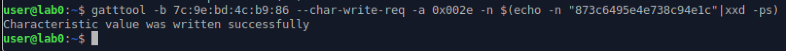

# BLE Hack Lab

This lab walks through some tools that are used for hacking Bluetooth Low Energy (BLE). Our target is a Bluetooth CTF project designed to allow users to learn about core concepts of Bluetooth client and server interactions. (<a href="https://github.com/hackgnar/ble_ctf_infinity">BLE CTF Infinity</a>)

## Tips for this lab

:warning: BLE devices are finicky. You may encounter errors when following this lab. Here are some helpful tips:
1. Don't be afraid to retry commands multiple times if you get an error. You may also see error messages when in fact the command was successful.
2. Remove and re insert the Bluetooth dongle.
3. Power cycle the BLE CTF device.

## Gatt Servers

## Something

### References
- <a href="https://github.com/hackgnar/ble_ctf_infinity">https://github.com/hackgnar/ble_ctf_infinity</a>
- Chapter 11 of <a href="https://nostarch.com/practical-iot-hacking">Practical IoT Hacking<a/> from No Starch Press.
