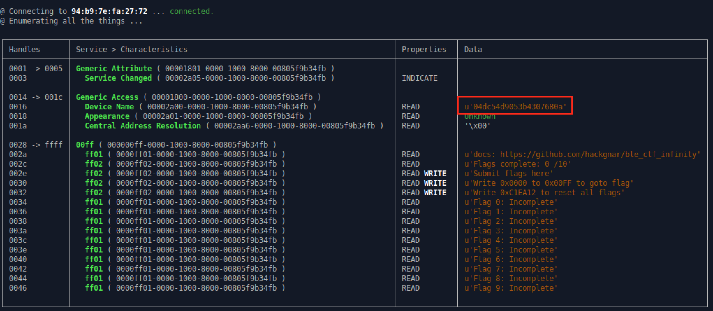
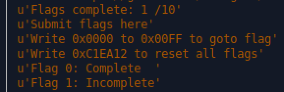

## Flag 0

Here are the target devices for reference:

1. 08:3A:F2:7D:65:8A
2. 94:B9:7E:FA:27:72
3. 94:B9:7E:F9:21:B6
4. 94:B9:7E:FA:71:F2
5. 94:B9:7E:FA:2A:42
6. 4C:EB:D6:75:4E:B6
7. 94:B9:7E:DA:08:56

Use `bleah` to enumerate the characteristics on the device. (Remember to change the device MAC address)

```
$ sudo bleah -b 94:B9:7E:FA:27:72 -e
```

⚠️ Try this a few times if it doesn't work and/or removing and plugging in the bluetooth dongle.

For the flag 0, we notice that the 'Device Name' kinda looks like a flag.




## Submit the Flag

Write the value to where we submit flags, handle `0x002e`.

```bash
$ gatttool -b 94:B9:7E:FA:27:72 --char-write-req -a 0x002e -n $(echo -n "04dc54d9053b4307680a" | xxd -ps)
```
⚠️ Try this until we get the message:
```
Characteristic value was written successfully
```

## Check Your Score

Now let's check the scoreboard again with `bleah`:

```
$ sudo bleah -b 94:B9:7E:FA:27:72 -e
```

We should see that Flag 0 is now complete.


