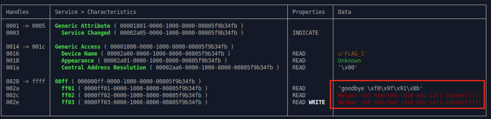

## Flag 1

Here are the target devices for reference:

1. 08:3A:F2:7D:65:8A
2. 94:B9:7E:FA:27:72
3. 94:B9:7E:F9:21:B6
4. 94:B9:7E:FA:71:F2
5. 94:B9:7E:FA:2A:42
6. 4C:EB:D6:75:4E:B6
7. 94:B9:7E:DA:08:56

### Navigate to Flag 1 Challenge

Navigate to challenge 1 by writing `0x0001` to handle `0x0030`
```
gatttool -b 94:B9:7E:FA:27:72 --char-write-req -a 0x0030 -n 0001
```

⚠️ Retry the command and/or replugging in the dongle until we get the following message:
```
Characteristic Write Request failed: Request attribute has encountered an unlikely error
```

### Use Bleah to Enumerate All Characteristics

At this point, if we try to use `bleah` to enumerate the characteristics, we see that `bleah` shows us some interesting values.

```
$ sudo bleah -b 94:B9:7E:FA:27:72 -e
```



When enumerating, the value at handle `0x002a` returns `goodbye 👋`. This disconnects the device. We have to use another tool to target reading the other values.


### Use Gatttool to Read Characteristics

Read the value at `0x002c` using `gatttool`.

``` bash
$ gatttool -b 94:B9:7E:FA:27:72 char-read -a 0x002c
```


Gatttool returns values that are hex encoded. Once decoded, the value at `0x002c` looks like our flag :)

### Submit the Flag

Write the `873c6495e4e738c94e1c` to handle `0x002e`.

```bash
$ gatttool -b 94:B9:7E:FA:27:72 --char-write-req -a 0x002e -n $(echo -n "873c6495e4e738c94e1c" | xxd -ps)
```
⚠️ Try this until we get the message:
```
Characteristic value was written successfully
```

### Check Your Score

Navigate to the scoreboard (or you can just navigate to the next challenge).

```bash
$ gatttool -b 94:B9:7E:FA:27:72 --char-write-req -a 0x0030 -n 0000
```
⚠️ Retry the command and/or replugging in the dongle until we get the following message:
```
Characteristic value was written successfully
```

Use bleah to check the scoreboard.
```
$ sudo bleah -b 94:B9:7E:FA:27:72 -e
```
