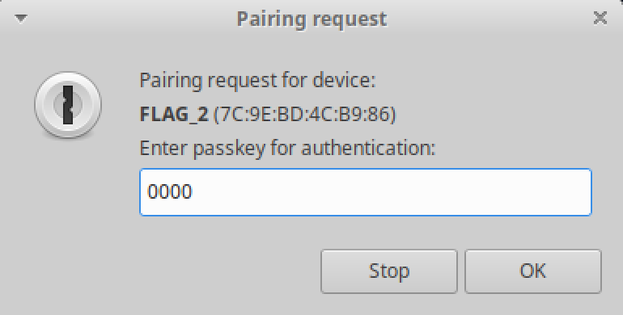

## Flag 2

Here are the target devices for reference:

1. 08:3A:F2:7D:65:8A
2. 94:B9:7E:FA:27:72
3. 94:B9:7E:F9:21:B6
4. 94:B9:7E:FA:71:F2
5. 94:B9:7E:FA:2A:42
6. 4C:EB:D6:75:4E:B6
7. 94:B9:7E:DA:08:56

### Navigate to Flag 2 Challenge

Navigate to challenge 2 by writing `0x0002` to handle `0x0030`
```
gatttool -b 94:B9:7E:FA:27:72 --char-write-req -a 0x0030 -n 0002
```

⚠️ Retry the command and/or replugging in the dongle until we get the following message:
```
Characteristic Write Request failed: Request attribute has encountered an unlikely error
```

### View Gatt Table

After switching to challenge 2, use `bleah` to enumerate its characteristics again.
```
$ sudo bleah -b 94:B9:7E:FA:27:72 -e
```


We see that there is some authentication required, and that we should connect with pin 0000. We can do this with `gatttool`.

### Use Gatttool with Authentication

```bash
$ gatttool --sec-level=high -b 94:B9:7E:FA:27:72 --char-read -a 0x002c
```
This will prompt you for the pin. Enter `0000` and click `OK`.



After authenticating, it will then print the value of `0x002c`.


Using <a href="https://gchq.github.io/CyberChef/#recipe=From_Hex('Auto')&input=MzUgNjQgMzYgMzkgMzYgNjMgNjQgNjYgMzUgMzMgNjEgMzkgMzEgMzYgNjMgMzAgNjEgMzkgMzggNjQ">Cyberchef</a> we see
```
35 64 36 39 36 63 64 66 35 33 61 39 31 36 63 30 61 39 38 64
```
decodes to
```
5d696cdf53a916c0a98d
```

### Submit the Flag
Submit the flag with `gatttool`.

```bash
$ gatttool -b 94:B9:7E:FA:27:72 --char-write-req -a 0x002e -n $(echo -n "5d696cdf53a916c0a98d" | xxd -ps)
```
⚠️ Try this until we get the message:
```
Characteristic value was written successfully.
```

### Check Your Score

Navigate to the scoreboard (or you can just navigate to the next challenge).

```bash
$ gatttool -b 94:B9:7E:FA:27:72 --char-write-req -a 0x0030 -n 0000
```
⚠️ Retry the command and/or replugging in the dongle until we get the following message:
```
Characteristic value was written successfully
```

Use bleah to check the scoreboard.
```
$ sudo bleah -b 94:B9:7E:FA:27:72 -e
```
