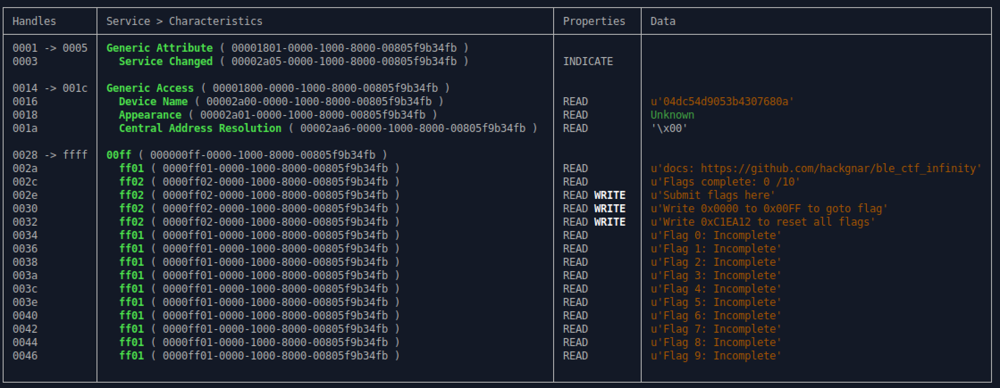

## Getting Started

### Devices

Because it may be difficult to scan for all Bluetooth devices in such a crowded area, the BLE_CTF_INFINITY MAC addresses are provided below. If you are at a provided lab machine, try use the same number as your lab number. 1-5.

1. 08:3A:F2:7D:65:8A
2. 94:B9:7E:FA:27:72
3. 94:B9:7E:F9:21:B6
4. 94:B9:7E:FA:71:F2
5. 94:B9:7E:FA:2A:42
6. 4C:EB:D6:75:4E:B6
7. 94:B9:7E:DA:08:56

## Tools

We can use a few different tools to solve some BLE CTF Infinity challenges.

- hciconfig
- bleah
- gatttool

### Hciconfig

You can view BLE interfaces on you system by using the `hciconfig` command. You should see at least one interface.


### Gatttool

We use `gatttool` to write flags and to navigate to the different challenges. We can write `0000` to handle `0x0030` go to scoreboard at any time. This is also where flag 0 is.
```bash
$ gatttool -b 94:B9:7E:FA:27:72 --char-write-req -a 0x0030 -n 0000
```

When navigating to different challenges, you will probably get the following error:
```
Characteristic Write Request failed: Request attribute has encountered an unlikely error
```
This is unavoidable because of the way the CTF was architected.


### Bleah

Although actually deprecated in favor of Bettercap, it may be easier to use bleah to target which device to enumerate characteristics.

```
$ sudo bleah -b 94:B9:7E:FA:27:72 -e
```


