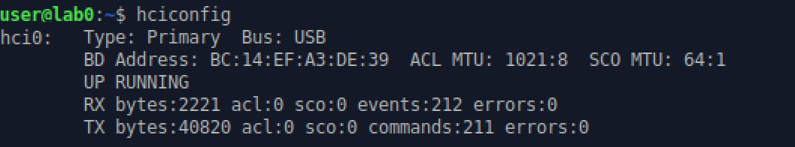
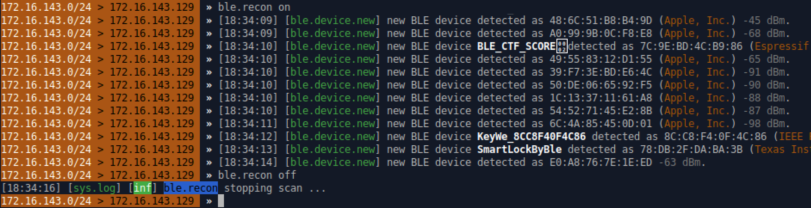
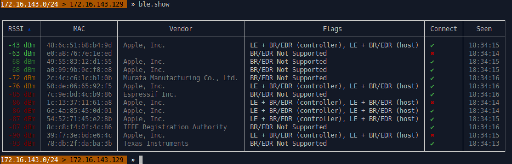
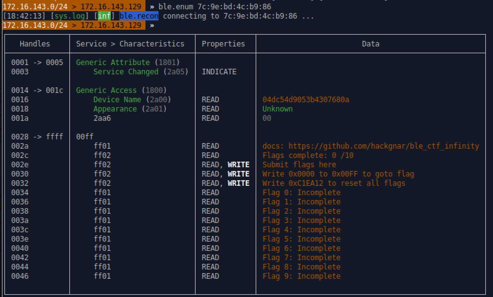
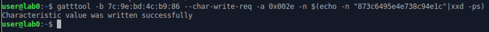
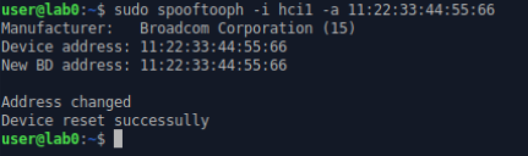
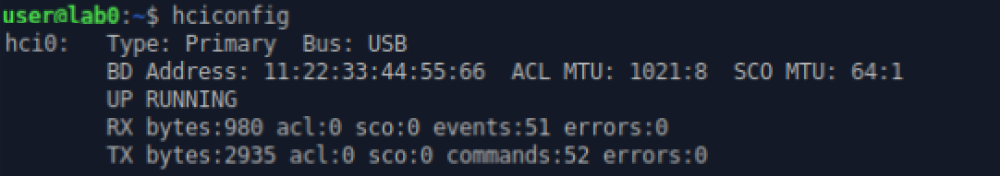

This lab walks through some tools that are used for hacking Bluetooth Low Energy (BLE). Our target is a Bluetooth CTF project designed to allow users to learn about core concepts of Bluetooth client and server interactions. (<a href="https://github.com/hackgnar/ble_ctf_infinity">BLE CTF Infinity</a>)

## Tips for this lab

:warning: BLE devices are finicky. You may encounter errors when following this lab. Here are some helpful tips:
1. Don't be afraid to retry commands multiple times if you get an error. You may also see error messages when in fact the command was successful.
2. Remove and re insert the Bluetooth dongle.
3. Power cycle the BLE CTF device.

## Gatt Server

## hciconfig

You can view BLE interfaces on you system by using the `hciconfig` command. You should see at least one interface.




## Bettercap

We need to discover the address of our target BLE device. There are many tools that can accomplish this. We will use <a href="https://bettercap.org">bettercap</a> in the command line.

Start bettercap (lab machine passwords: password)
```bash
$ sudo bettercap
```
Run recon to list discovered BLE devices. Note, there will probably be **many** discovered devices in crowded areas. You should turn off recon mode quickly after.
```
» ble.recon on
» ble.recon off
```
You should see similar output as below. We are looking for the address of devices named `BLE_CTF_SCORE`. There should be several. Choose one and copy the MAC address. This will be our target for the rest of the lab.



After running `ble.recon`, you can display discovered devices with additional info including signal strength, the chip vendor, and connection status.
```
» ble.show
```


Now that we have found the address of our target, we can enumerate characteristics and services of what is running on the gatt server. Run the following command, replacing the MAC address with your selected target.

```
» ble.enum AA:BB:CC:DD:EE:FF
```



This is the BLE CTF Infinity scoreboard, which nicely shows our progress. We should see that 0/10 flags are complete. There are also 2 important things we should take away from this:
1. We write all flags to handle `0x002e`
2. We navigate between challenges (flags) by writing a value between `0x0000` and `0x00FF` to handle `0x0030`.

The BLE CTF is made of multiple Gatt servers which we need to rotate through by writing values to `0x0030`


**Note**: We have be using `bettercap` in interactive mode. You can also run individual commands from the shell prompt.

```bash
$ sudo bettercap --eval "ble.recon on"
```

We will continue to use `bettercap` throughout this lab, but for now let's look at another tool.

## Gatttool


## Something









### References
- <a href="https://github.com/hackgnar/ble_ctf_infinity">https://github.com/hackgnar/ble_ctf_infinity</a>
- Chapter 11 of <a href="https://nostarch.com/practical-iot-hacking">Practical IoT Hacking</a> from No Starch Press.
