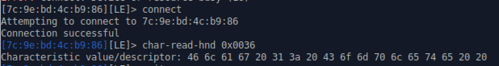
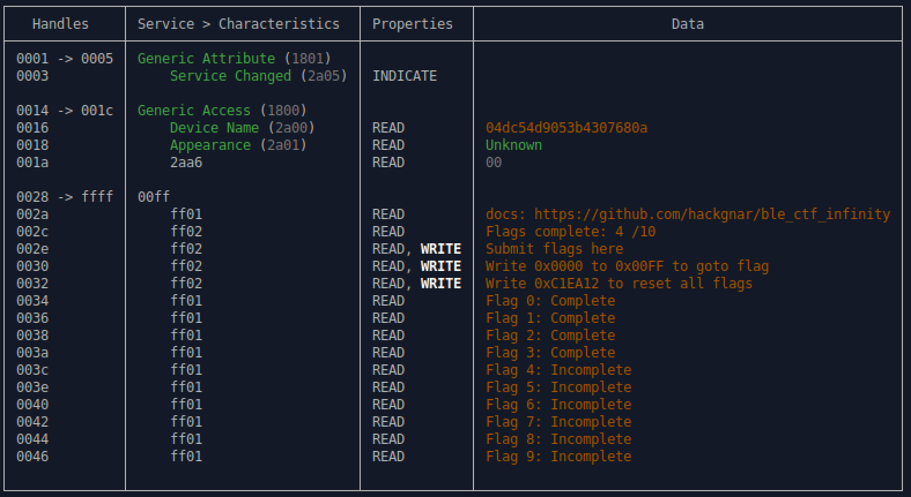

This lab walks through some tools that are used for hacking Bluetooth Low Energy (BLE). Our target is a Bluetooth CTF project designed to allow users to learn about core concepts of Bluetooth client and server interactions. (<a href="https://github.com/hackgnar/ble_ctf_infinity">BLE CTF Infinity</a>)

## Tips for this lab

:warning: BLE devices are finicky. You may encounter errors when following this lab. Here are some helpful tips:
1. Don't be afraid to retry commands multiple times if you get an error. You will also see error messages when in fact the command was successful.
2. Remove and re insert the Bluetooth dongle. (Or run `sudo systemctl restart bluetooth`)
3. Power cycle the BLE CTF device. (Progress will persist, but you will need to navigate to the challenge again)

## Tools

We can use a few different tools to solve some BLE CTF Infinity challenges.

- hciconfig
- bettercap
- gatttool

### Hciconfig

You can view BLE interfaces on you system by using the `hciconfig` command. You should see at least one interface.


### Bettercap

We need to discover the address of our target BLE device. There are many tools that can accomplish this. We will use <a href="https://bettercap.org">bettercap</a> in the command line.

Start bettercap (lab machine passwords: password)
```bash
$ sudo bettercap
```
Run recon to list discovered BLE devices. Note, there will probably be **many** discovered devices in crowded areas. You should turn off recon mode quickly after.
```
» ble.recon on
» ble.recon off
```
You should see similar output as below. We are looking for the address of devices named `BLE_CTF_SCORE`. There should be several. Choose one and copy the MAC address. This will be our target for the rest of the lab.


After running `ble.recon`, you can display discovered devices with additional info including signal strength, the chip vendor, and connection status.
```
» ble.show
```


Now that we have found the address of our target, we can enumerate characteristics and services of what is running on the gatt server. Run the following command, replacing the MAC address with your selected target.

```
» ble.enum AA:BB:CC:DD:EE:FF
```


This is the BLE CTF Infinity scoreboard, which nicely shows our progress. We should see that 0/10 flags are complete. There are also 2 important things we should take away from this:
1. We write all flags to handle `0x002e`
2. We navigate between challenges (flags) by writing a value between `0x0000` and `0x00FF` to handle `0x0030`.

The BLE CTF is made of multiple Gatt servers which we need to rotate through by writing values to `0x0030`


**Note**: We have be using `bettercap` in interactive mode. You can also run commands from a shell prompt.

```bash
$ sudo bettercap --eval "ble.recon on"
```

### Gatttool


We can use `gatttool` to write values to handle `0x0030` to navigate to different challenges. We can write `0000` to go to scoreboard at any time. This is also where flag 0 is.
```bash
$ gatttool -b AA:BB:CC:DD:EE:FF --char-write-req -a 0x00300 -n 0000  
```

When doing this, you will get the following error:
```
Characteristic Write Request failed: Request attribute has encountered an unlikely error
```
This is actually expected, and is what we are looking for to know the value was successfully written when navigating between the scoreboard and challenges. Its unavoidable because of the way the CTF was architected.


## Flag 0

We can see the 'Device Name' is actually the flag.


Exit bettercap.

## Submit the Flag

Write the value to where we submit flags, handle `0x002e`. (Remember to change the device MAC address)

```bash
$ gatttool -b AA:BB:CC:DD:EE:FF --char-write-req -a 0x002e -n $(echo -n "04dc54d9053b4307680a" | xxd -ps)
Characteristic value was written successfully
```

## Check Your Score

Now let's check the scoreboard. Go back into bettercap, run recon, and enumerate the device.
```bash
$ sudo bettercap
```
```
» ble.recon on
» ble.recon off
» ble.enum AA:BB:CC:DD:EE:FF
```
We should see that Flag 0 is now complete.


## Flag 1

### Navigate to Flag 1 Challenge

Navigate to challenge 2 by writing `0x0001` to handle `0x0030`
```
gatttool -b AA:BB:CC:DD:EE:FF --char-write-req -a 0x0030 -n 0001
```

### Failure Enumerating Characteristics
At this point, if we try to use `bettercap` to enumerate the characteristics, we see that `bettercap` hangs and never returns output like for the scoreboard.


### Use Gatttool to Read Characteristics

Lets try to use the `gatttool` to figure out what is going on. Start `gatttool` in interactive mode.


``` bash
$ gatttool -b AA:BB:CC:DD:EE:FF -I
```
Connect to the device and list the primary services.
```
> connect
> primary
> char-read-hnd 0x0001
> char-read-hnd 0x0024
> char-read-hnd 0x0028
```
From there we can read the listed service handles.


 These don't provide anything that looks like a flag though. Recall in `bettercap` that we saw additional handles.


Let's try reading those.

```
> char-read-hnd 0x002a
```


Remember that `gatttool` is showing us the values hex encoded. Use your preferred method of decoding this. <a href="https://gchq.github.io/CyberChef/#recipe=From_Hex('Auto')&input=IDY3IDZmIDZmIDY0IDYyIDc5IDY1IDIwIGYwIDlmIDkxIDhi">Cyberchef</a> is an easy tool to use.

We see that the value
```
67 6f 6f 64 62 79 65 20 f0 9f 91 8b
```
decodes to
```
goodbye 👋
```
This is followed by an error. It seems that we have been disconnected from the device. This perhaps explains why `bettercap` fails to enumerate the device characteristics.

Reconnect and read `0x002e`
```
> char-read-hnd 0x002e
```


Decoding this hex shows gives us "write here to goto to scoreboard".

Read `0x002c`

```
> char-read-hnd 0x002c
```


The value at `0x002c` decoded looks like our flag :)

### Submit the Flag

Write the `873c6495e4e738c94e1c` to handle `0x002e`.

```bash
$ gatttool -b AA:BB:CC:DD:EE:FF --char-write-req -a 0x002e -n $(echo -n "873c6495e4e738c94e1c" | xxd -ps)
Characteristic value was written successfully
```

### Check Your Score
Navigate back to the scoreboard by writing `0x0000` to `0x0030`.

```bash
$ gatttool -b AA:BB:CC:DD:EE:FF --char-write-req -a 0x0030 -n 0000
```
You can check your progress for flag 1 by using `bettercap` and `ble.enum`, or you can read the handle directly using `gatttool`.

```bash
$ gatttool -b AA:BB:CC:DD:EE:FF -I
```
```
> connect
> char-read-hnd 0x0036
```


Decode the value with <a href="https://gchq.github.io/CyberChef/#recipe=From_Hex('Auto')&input=NDYgNmMgNjEgNjcgMjAgMzEgM2EgMjAgNDMgNmYgNmQgNzAgNmMgNjUgNzQgNjUgMjAgMjA">Cyberchef</a>. You should see "Flag 1: Complete".


## Flag 2

### Navigate to Flag 2 Challenge

Navigate to challenge 2 by writing `0x0002` to handle `0x0030`
```bash
$ gatttool -b AA:BB:CC:DD:EE:FF --char-write-req -a 0x0030 -n 0002
```

### View Gatt Table

After switching to challenge 2, use `bettercap` to enumerate its characteristics again.
```bash
$ sudo bettercap
```
```
> ble.recon on
> ble.recon off
> ble.enum AA:BB:CC:DD:EE:FF
```


We see that there is some authentication required, and that we should connect with pin 0000. We can do this with `gatttool`.

### Use Gatttool with Authentication

```bash
$ gatttool --sec-level=high -b AA:BB:CC:DD:EE:FF --char-read -a 0x002c
```
This will prompt you for the pin. Enter `0000` and click `OK`.


After authenticating, it will then print the value of `0x002c`.


Using <a href="https://gchq.github.io/CyberChef/#recipe=From_Hex('Auto')&input=MzUgNjQgMzYgMzkgMzYgNjMgNjQgNjYgMzUgMzMgNjEgMzkgMzEgMzYgNjMgMzAgNjEgMzkgMzggNjQ">Cyberchef</a> we see
```
35 64 36 39 36 63 64 66 35 33 61 39 31 36 63 30 61 39 38 64
```
decodes to
```
5d696cdf53a916c0a98d
```

### Submit the Flag
Submit the flag with `gatttool`.

```bash
$ gatttool -b AA:BB:CC:DD:EE:FF --char-write-req -a 0x002e -n $(echo -n "5d696cdf53a916c0a98d" | xxd -ps)
Characteristic value was written successfully
```

### Check Your Score
Navigate back to the scoreboard by writing `0x0000` to `0x0030`.

```bash
$ gatttool -b AA:BB:CC:DD:EE:FF --char-write-req -a 0x0030 -n 0000
```
You can check your progress for flag 2 by using `bettercap` or reading handle `0x0038` with `gatttool`. You should see that flag 2 is now complete.


## Flag 3

### Navigate to Flag 3 Challenge

Navigate to challenge 3 by writing `0x0003` to handle `0x0030`
```bash
$ gatttool -b AA:BB:CC:DD:EE:FF --char-write-req -a 0x0030 -n 0003
```

### View Gatt Table

Use `bettercap` to enumerate its characteristics again.
```bash
$ sudo bettercap
```
```
> ble.recon on
> ble.recon off
> ble.enum AA:BB:CC:DD:EE:FF
```


We can see that it is looking for a device with the MAC address `11:22:33:44:55:66` to connect to it.

## View the Interface MAC Address

Use `hciconfig` to view the MAC address of the interface.


### Spooftooph

We can spoof our mac address with the tool `spooftooph`. (Make sure to use `sudo`)
```
$ sudo spooftooph -i hci0 -a 11:22:33:44:55:66
```


Once we have done this, we need to reset the interface for the changes to take.
```
$ sudo hciconfig hci0 reset
```
Now `hciconfig` should show the new MAC.


### Read the Gatt Table with Spoofed MAC

Using `bettercap` with the spoofed MAC we can now read the flag: `0ad3fe0c58e0a47b8afb`.


### Submit the Flag
Submit the flag with `gatttool`.

```bash
$ gatttool -b AA:BB:CC:DD:EE:FF --char-write-req -a 0x002e -n $(echo -n "0ad3fe0c58e0a47b8afb" | xxd -ps)
Characteristic value was written successfully
```

### Check Your Score
Navigate back to the scoreboard by writing `0x0000` to `0x0030`.

```bash
$ gatttool -b AA:BB:CC:DD:EE:FF --char-write-req -a 0x0030 -n 0000
```
You can check your progress for flag 3 by using `bettercap` or reading handle `0x0038` with `gatttool`. You should see that flag 3 is now complete.




## Finishing up

Thats it for this lab. You are welcome to continue to try the other challenges.
If you are done, reset the CTF by writing `0xC1EA12` to handle `0x0032`.

```bash
$ gatttool -b AA:BB:CC:DD:EE:FF --char-write-req -a 0x0032 -n C1EA12
```

### References
- <a href="https://github.com/hackgnar/ble_ctf_infinity">https://github.com/hackgnar/ble_ctf_infinity</a>
- Chapter 11 of <a href="https://nostarch.com/practical-iot-hacking">Practical IoT Hacking</a> from No Starch Press.
